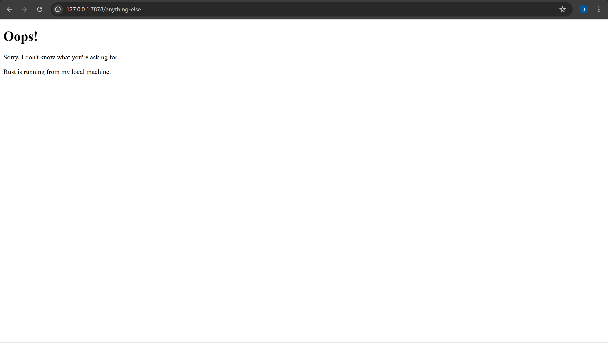

# Module 06 - Concurrency

## Commit 1 Reflection notes

In this first milestone, I implemented a basic TCP listener that binds to a local address to intercept incoming web requests. The core logic resides in the `handle_connection` function, which manages the data stream between the server and the client. I used `BufReader` to wrap the `TcpStream`, which allows for more efficient reading by buffering the input rather than making frequent system calls. By utilizing the `lines()` method combined with a `take_while` closure, the program can specifically identify the end of an HTTP request's headers, which is always marked by an empty line. This approach is quite effective for parsing simple requests, although at this stage, the server only prints the data to the terminal and does not yet send a response back to the browser. It was interesting to see how low-level networking is handled in Rust compared to the "magic" found in high-level frameworks like Spring Boot.

## Commit 2 Reflection notes

For the second milestone, I modified the server to return a formal HTTP response containing an HTML document instead of just logging request headers. I created a separate `hello.html` file and used the `fs::read_to_string` function to load its content into memory within the `handle_connection` function. A critical part of this implementation was constructing the response string using the correct HTTP format, which includes a status line, headers, and the message body separated by specific CRLF (`\r\n`) sequences. Specifically, I included the `Content-Length` header, which is essential for the browser to know how much data to expect before closing the connection. This phase demonstrated how raw strings are transformed into rendered web content through the standardized HTTP protocol. It was satisfying to see the browser finally display a rendered page rather than simply hanging.

## Commit 3 Reflection notes

In this milestone, I implemented request validation to distinguish between a valid request for the root path and any other undefined endpoints. I refactored the `handle_connection` function to read only the first line of the HTTP request, which contains the method, path, and HTTP version. By using a conditional `if/else` block, the server now assigns the appropriate status line and filename based on whether the request line matches "GET / HTTP/1.1". This refactoring is essential because it eliminates code duplication; instead of having multiple blocks that handle file reading and stream writing, the logic is consolidated after the routing decision is made. It ensures that the server can gracefully handle errors by providing a meaningful 404 page rather than simply failing or returning incorrect data. This approach highlights the importance of clean control flow in backend development to maintain readability and scalability as more routes are added.

